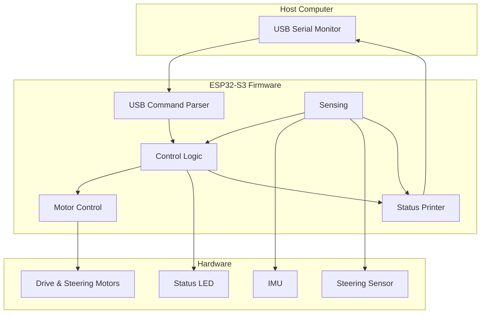

# Micro-controller Firmware

This firmware runs on an ESP32-S3 microcontroller to control a 1/10th scale autonomous vehicle. It provides motor control, steering, IMU sensing, USB serial status output, and simple USB serial commands for hardware bring-up.

## Hardware Requirements

### Required Components

- **ESP32-S3-DevKitC-1** development board or [CDA1Tenth PCB](docs/10th_Scale_Board.drawio.png)
- **TMC5160 Stepper Drivers** (3x):
  - One for steering motor
  - One for left drive motor
  - One for right drive motor
- **LSM6DSO IMU** sensor (6-DOF accelerometer/gyroscope)
- **Motors**: Stepper motors for drive and steering
- **Power Supply**: Appropriate voltage/current for motors and ESP32
- **USB-C Cable**: For programming, status output, and bring-up commands

### Pin Connections

The firmware uses the following GPIO pins on the ESP32-S3:

| Pin                  | Function        | Description                                                        |
| -------------------- | --------------- | ------------------------------------------------------------------ |
| **SPI Bus**          |                 |                                                                    |
| IO 11                | MOSI            | SPI Master Out Slave In                                            |
| IO 12                | SCK             | SPI Clock                                                          |
| IO 13                | MISO            | SPI Master In Slave Out                                            |
| **Chip Select Pins** |                 |                                                                    |
| IO 14                | CS_IMU          | Chip select for LSM6DSO IMU                                        |
| IO 39                | CS_RIGHT        | Chip select for right motor TMC5160 (TMC 5160 (0))                 |
| IO 40                | CS_LEFT         | Chip select for left motor TMC5160 (TMC 5160 (1))                  |
| IO 41                | CS_STEER        | Chip select for steering motor TMC5160 (TMC 5160 (2))              |
| **Control Pins**     |                 |                                                                    |
| IO 4                 | EN_PIN          | Motor enable pin                                                   |
| IO 18                | STEERING_SENSOR | Steering angle sensor (analog input)                               |
| IO 37                | LED_PIN         | Status LED                                                         |
| IO 15                | BACK_LIGHTS     | 7-pixel rear RGB light strip data pin                              |
| IO 16                | FRONT_LIGHTS    | 7-pixel front RGB light strip data pin                             |
| **Other Pins**       |                 |                                                                    |
| IO 0                 | BOOT            | Boot mode selection (normally floating, can be pulled low with S2) |
| EN                   | RESET           | Reset pin (normally pulled up, can be pulled low with S1)          |
| IO 1-2               | ESTOP           | Emergency stop pins (connected to TMC5160 estop)                   |
| IO 17                | BATTERY_VOLTAGE | Battery voltage monitoring (1:8 voltage divider)                   |
| IO 19-20             | USB             | USB connection pins                                                |

> **Note:** A detailed PCB diagram (`10th_Scale_Board.drawio.png`) is available in the `docs/` folder showing the complete board layout, pin connections, and component placement.

## Building and Running

0. Install Platform IO using the following installation [guide](https://docs.platformio.org/en/latest/integration/ide/vscode.html#installation)

1. Build the project:

   ```bash
   pio run
   ```

2. Use a USB cable to connect your laptop to the micro-controller board's USB-C port

3. Put the ESP32 into the manual bootloader mode if needed ([docs by EXPRESSIF](https://docs.espressif.com/projects/esptool/en/latest/esp32/advanced-topics/boot-mode-selection.html#manual-bootloader)).

4. Upload to your ESP32:

   ```bash
   pio run --target upload
   ```

5. Monitor serial output at 115200 baud:

   ```bash
   pio device monitor --baud 115200
   ```

If `pio` is not on your shell path, this local install path worked during development:

```bash
/home/george/.platformio/penv/bin/pio run
```

## USB Serial Commands

The firmware accepts newline-terminated commands over USB serial. Type commands into the serial monitor and press Enter.

| Command | Description |
| ------- | ----------- |
| `help` | Print the command list |
| `status` | Print current command, motor, steering, IMU, and calibration status |
| `zero_steer` | Save the current steering sensor angle as the steering center |
| `offset <deg>` | Manually set and save the steering encoder offset |
| `steer <deg>` | Command a steering angle in degrees |
| `speed <rpm>` | Command drive motor speed in RPM without changing steering target |
| `v <linear_mps> <angular_radps>` | Command linear velocity and angular velocity |
| `stop` | Stop drive motion and return steering target to zero |

Recommended first steering calibration:

```text
zero_steer
status
steer 1
status
steer -1
status
stop
```

`zero_steer` stores the steering center in ESP32 nonvolatile storage. The saved value is loaded automatically on boot. `offset <deg>` can be used to set that value manually.

Keep the car lifted or otherwise restrained during early motor tests.

## BLE Vehicle Light Commands

The light strips are controlled through BLE text commands and the drive-control button bitmask:

| Command | Description |
| ------- | ----------- |
| `signal left` | Blink the left signal lights |
| `signal right` | Blink the right signal lights |
| `signal hazard` | Blink both signal light sides |
| `signal off` | Turn signal blinking off |
| `headlights on` | Turn the middle 3 headlights on |
| `headlights off` | Turn the middle 3 headlights off |
| `headlight_color <r> <g> <b>` | Set headlight color, each channel `0`-`255` |
| `signal_color <r> <g> <b>` | Set signal color, each channel `0`-`255` |
| `light <index> <r> <g> <b>` | Set a base color for one front light pixel |

The front strip uses 7 LEDs. Pixels `5` and `6` are the left signal, pixels `0` and `1` are the right signal, and pixels `2`, `3`, and `4` are headlights. Left/right signals automatically turn off when the measured steering position re-enters the centered zone from the active signal side; hazard lights do not auto-cancel.

The rear strip uses 7 LEDs. Pixels `5` and `6` are the left signal, pixels `0` and `1` are the right signal, pixels `2`, `3`, and `4` are red brake lights, and the two outermost rear pixels turn steady white while reversing. Brake lights stay on while stationary and turn on briefly when commanded speed is reduced.

While waiting for a BLE connection, both strips show a Bluetooth-blue fill/drain animation. When BLE connects, all pixels double-blink blue.

The phone app's drive-control button bitmask also controls the front lights on button press:

| App Button | Bit | Action |
| ---------- | --- | ------ |
| `1` | `0x01` | Toggle left signal |
| `2` | `0x02` | Toggle right signal |
| `3` | `0x04` | Toggle headlights |
| `4` | `0x08` | Toggle hazard lights |
| `5` | `0x10` | Rezero steering |

## MQTT Traffic Light Demo

The firmware can participate in the MQTT traffic light demo using broker `172.250.250.111:1883`.

Place the demo WiFi credentials in `include/secrets.h`; `include/secrets.example.h` has the expected shape:

```cpp
#define MQTT_WIFI_SSID "your-wifi-ssid"
#define MQTT_WIFI_PASSWORD "your-wifi-password"
```

`include/secrets.h` is ignored by git. With credentials present, the vehicle firmware subscribes to:

| Topic | Purpose |
| ----- | ------- |
| `esp32/1/spat` | J2735-style SPaT signal state |
| `esp32/1/map` | Approach/lane to signal group mapping |

Default vehicle approach is east / ingress approach `2` / signal group `2`. The retained MAP can switch this automatically; with the current single-light bench MAP, the vehicle will switch to signal group `1`. Override at build time with `MQTT_VEHICLE_APPROACH`, `MQTT_VEHICLE_INGRESS_APPROACH`, or `MQTT_VEHICLE_SIGNAL_GROUP`, or send the BLE command:

```text
traffic_group 3
```

Vehicle behavior from SPaT:

| SPaT event state | Vehicle behavior |
| ---------------- | ---------------- |
| `protected-Movement-Allowed` | Drive normally |
| `protected-clearance` | Drive at half speed |
| `stop-And-Remain` | Mandatory stop |
| Missing or stale SPaT | Mandatory stop |

Useful BLE demo commands:

| Command | Description |
| ------- | ----------- |
| `traffic_status` | Show MQTT connection, group, state, multiplier, and phase time |
| `traffic_group <n>` | Manually select the vehicle signal group |

## System Architecture

The firmware implements a single-threaded USB bring-up control loop:



### Control Loop

The main Arduino `loop()` runs three activities:

1. **Command Handling**

   - Reads USB serial input
   - Parses text commands
   - Updates velocity, speed, steering, and calibration targets

2. **50 Hz Control Update**

   - Updates IMU sensor readings
   - Converts velocity commands into steering angle and RPM
   - Applies steering and drive motor targets

3. **1 Hz Status Output**

   - Prints command state
   - Prints steering target and measured steering angle
   - Prints motor RPM
   - Prints IMU accelerometer and gyro readings

### Data Flow

Key data flows:

- **Command Flow**: USB serial command -> ESP32 parser -> control logic -> motor targets
- **Sensor Flow**: IMU and steering sensor -> sensor manager -> status output/control logic
- **Motor Flow**: control logic -> TMC5160 drivers over SPI -> drive and steering motors
- **Status Flow**: ESP32 diagnostics -> USB serial monitor

## LED Status Codes

The ESP32 board LED (IO 37) provides visual feedback about the system status:

| LED Pattern   | Meaning                           |
| ------------- | --------------------------------- |
| **1 flash**   | Waiting for USB serial connection |
| **2 flashes** | Initial setup complete            |
| **3 flashes** | Sensor initialization failed      |

## Configuring the Car Controller

The controller has several important physical and safety parameters:

| Parameter | Default | Description |
| --------- | ------- | ----------- |
| `wheel_radius` | `0.0325` m | Wheel radius used to convert linear speed into RPM |
| `wheelbase` | `0.185` m | Distance between front and rear axles |
| `track_width` | `0.15` m | Distance between left and right wheels |
| `encoder_offset` | `187.5` deg | Steering sensor angle treated as centered |
| `max_steering_angle` | `30.0` deg | Maximum steering command |
| `max_rpm` | `300.0` RPM | Maximum motor speed command |

### Steering Offset Calibration

The `encoder_offset` parameter is particularly important for accurate steering control. It compensates for the steering sensor's raw angle when the wheels are physically centered.

To calibrate:

1. Physically center the front wheels.
2. Send:

   ```text
   zero_steer
   ```

3. Check:

   ```text
   status
   ```

`actual_steer` should be close to zero when the wheels are centered.

You can also set an offset manually:

```text
offset 135.5
```

## Status Data

The `status` command and automatic 1 Hz status line report:

| Field | Description | Units |
| ----- | ----------- | ----- |
| `ms` | Milliseconds since boot | ms |
| `cmd_v` | Commanded linear velocity | m/s |
| `cmd_w` | Commanded angular velocity | rad/s |
| `cmd_rpm` | Commanded speed target | RPM |
| `speed` | Current target car speed | RPM |
| `steer` | Commanded steering angle | degrees |
| `actual_steer` | Measured steering angle from the steering sensor | degrees |
| `offset` | Active steering center offset | degrees |
| `rpm_r` | Right motor RPM estimate | RPM |
| `rpm_l` | Left motor RPM estimate | RPM |
| `accel` | Accelerometer X/Y/Z | g |
| `gyro` | Gyroscope X/Y/Z | rad/s |

## Troubleshooting

### Motors Not Responding

**Symptoms**: Car does not move when commands are sent

**Solutions**:

1. Check motor power supply is connected and adequate
2. Verify TMC5160 drivers are properly connected (SPI, CS pins)
3. Check enable pin (IO 4) is properly configured
4. Verify motor wiring (phases, power)
5. Check serial monitor for motor-related errors
6. Try a small command first:

   ```text
   speed 10
   stop
   ```

### IMU Not Initializing

**Symptoms**: LED flashes 3 times at startup, IMU data is zero

**Solutions**:

1. Verify IMU is connected to SPI bus
2. Check CS_IMU pin (IO 14) connection
3. Verify IMU power supply
4. Check SPI bus connections (MOSI, MISO, SCK)
5. Try re-seating the IMU module

### Serial Port Issues

**Symptoms**: Cannot upload firmware or monitor serial output

**Solutions**:

1. **Windows**: Install USB-to-Serial drivers if required by your board
2. **Linux**: Add user to dialout group:

   ```bash
   sudo usermod -a -G dialout $USER
   # Log out and back in
   ```

3. Check port permissions:

   ```bash
   ls -l /dev/ttyACM0
   ```

4. Try a different USB cable (some cables are power-only)
5. Check if another program is using the port
6. List ports:

   ```bash
   pio device list
   ```

### Build Errors

**Symptoms**: `pio run` fails

**Solutions**:

1. Update PlatformIO:

   ```bash
   pio upgrade
   ```

2. Clean and rebuild:

   ```bash
   pio run --target clean
   pio run
   ```

3. Verify all dependencies in `platformio.ini` are accessible
4. Check internet connection for first-time dependency download

### Steering Not Accurate

**Symptoms**: Steering angle does not match commands

**Solutions**:

1. Calibrate steering offset with `zero_steer`
2. Verify steering sensor (IO 18) is connected
3. Check steering motor wiring and power
4. Verify gear ratio matches hardware (55:12 default)
5. Check for mechanical binding or resistance
6. Test with very small commands:

   ```text
   speed 5
   steer 1
   steer -1
   stop
   ```

### Steering Moves Only Briefly Or Only When Speed Is Set

**Symptoms**: Steering only moves after a speed command, or stops before reaching the target angle

**Solutions**:

1. Verify the current firmware has stationary steering enabled
2. Upload the latest firmware build
3. Confirm `status` updates after `steer <deg>`
4. Check motor power and steering driver wiring
5. Check for mechanical binding before increasing command size

### Getting Help

If issues persist:

1. Check serial monitor output for detailed status messages
2. Review LED status codes to identify the failure point
3. Verify all hardware connections match the pin table
4. Use low speed and steering commands while the car is lifted or restrained
